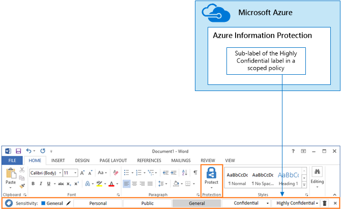

# 保护 SharePoint Online 网站和文件

本文介绍了如何配置 SharePoint Online 团队网站并对通过轻松协作权衡安全性的文件保护提供了相关建议。 本文定义了四个不同的配置，首先介绍的是具有最开放的共享策略的组织内的公共网站。 每个额外配置均表示有意义的保护设置，但对资源的访问和协作被限定为一组相关用户。 

使用这些建议作为起点并调整配置，以满足组织的需求。 

本文中的配置符合 Microsoft 针对数据、标识和设备的三层保护的建议：

* 基线保护
* 敏感保护
* 高度机密保护

有关这些保护层以及针对每层建议的功能的详细信息，请参阅以下资源。 

* [Office 365 的标识和设备保护](https://technet.microsoft.com/library/28986107-e2fb-4116-bfdd-f66d751a7c16#BKMK_O365IDP)
* [Office 365 中的文件保护解决方案](https://technet.microsoft.com/library/28986107-e2fb-4116-bfdd-f66d751a7c16#BKMK_O365fileprotect)

## 功能概述
针对各种 Office 365 功能的 SharePoint Online 团队网站绘制的建议。 对于高度机密的网站，建议使用 Azure 信息保护。 这包括在企业移动性 + 安全性 (EMS) 中。 

下图显示了针对四个 SharePoint Online 团队网站的建议配置。

 

如图所示：

* 基线保护包含针对 SharePoint Online 团队网站的两个选项 - 公共网站和专用网站。 组织中的任何人均可发现和访问公共网站。 只有网站成员可以发现和访问专用网站。 这两个网站配置均允许组外共享。 
* 敏感保护和高度机密的保护的网站是专用网站，只有特定组的成员才具有相关访问权限。
* Office 365 标签提供根据所需保护级别对数据进行分类的方法。 每个 SharePoint Online 团队网站均被配置为使用网站的默认标签自动标记文档库中的文件。 与四个网站配置相对应，此示例中的标签分别为内部公开、专用、敏感和高度机密。 用户可以更改标签，但此配置可确保所有文件均接收默认的标签。
* 为敏感和高度机密 Office 365 标签配置数据丢失防护 (DLP)，在其试图向组织外部发送这些类型的文件时警告或阻止用户。
* 对于配置有高度机密保护的网站，Azure 信息保护将对文件进行加密，并授予相应权限。

## SharePoint Online 和 OneDrive for Business 的租户范围内设置
SharePoint Online 和 OneDrive for Business 包括影响所有网站和用户的租户范围内设置。 其中一些设置也可在网站级别进行调整，使其更具有（而不是更不具有）限制性。 本部分讨论影响安全性和协作的租户范围内设置。 

### 共享
对于此解决方案，建议使用以下租户范围内设置：

* 保留允许所有与所有帐户类型共享（包括匿名共享）的默认共享策略。
* 如果需要，请将匿名链接设置为过期。
* 将共享的默认链接类型更改为“内部”。 这有助于防止数据意外泄露到组织外部。

虽然允许外部共享可能看起来有悖常理，但相较于通过电子邮件发送文件，此方法可更好地控制文件共享。 SharePoint Online 和 Outlook 彼此协作，提供安全的文件协作。 

* 默认情况下，Outlook 共享文件链接，而不是通过电子邮件发送文件。 
* SharePoint Online 和 OneDrive for Business 可轻松实现与组织内部和外部的参与者共享文件链接。

用户还可进行控制，帮助管理外部共享。 例如，你能够：

* 禁用匿名来宾链接。
* 撤销用户对网站的访问权限。
* 查看谁有权访问特定网站或文档。
* 将匿名共享链接设置为过期（租户设置）。
* 限制可与之共享的组织外部用户（租户设置）。

### 配合使用外部共享与数据丢失预防 (DLP)
如果不允许外部共享，则有业务需求的用户需要寻找备用工具和方法。 Microsoft 建议结合使用外部共享和 DLP 策略，保护敏感和高度机密文件。

### 设备访问设置
SharePoint Online 和 OneDrive for Business 的设备访问设置可确定是否已将访问权限限制为仅限浏览器（不能下载文件）或访问被阻止。 这些设置当前处于首次发布状态，仅应用于租户范围内。 即将推出以网站级别配置设备访问策略的功能。 对于此解决方案，建议不要使用应用于租户范围内的设备访问设置。

要使用处于首次发布状态的设备访问设置，请参阅：[在 Office 365 中设置标准发布或首次发布选项](https://support.office.com/article/Set-up-the-Standard-or-First-Release-options-in-Office-365-3B3ADFA4-1777-4FF0-B606-FB8732101F47)。

### OneDrive for Business
访问这些设置，确定是否要更改 OneDrive for Business 网站的默认设置。 目前，共享和设备访问设置与 SharePoint Online 管理中心重复，并适用于这两个环境。

## SharePoint 团队网站配置
下表总结了本文前面所述的每个团队网站的配置。 使用这些配置作为起点建议并调整网站类型和配置，以满足组织的需求。 不是每个组织都需要每种类型的网站。 只有少许组织需要高度机密的保护。

| |**基线保护 #1**|**基线保护 #2**|**敏感保护**|**高度机密**|
|:-----|:-----|:-----|:-----|:-----|
|说明|组织内的开放式发现和协作。|允许在组外部共享的专用网站和组。|独立网站，该网站中的访问级别由特定组中的成员身份进行定义。 仅允许网站成员进行共享。 DLP 在用户试图向组织外发送文件时警告用户。|启用 Azure 信息保护的独立网站和文件及权限。 DLP 阻止用户向组织外发送文件。|
|专用或公用团队网站|公用|Private|Private|Private|
|谁可以访问？|组织中的任何人，包括 B2B 用户和来宾用户。|仅限网站成员。 其他人可以请求访问。|仅限网站成员。 其他人可以请求访问。|仅限成员。 其他人无法请求访问。|
|网站级共享控制|允许与任何人共享。 默认设置。    |允许与任何人共享。 默认设置。|成员无法共享对网站的访问权限。  非成员可以请求访问该网站，但需要由网站管理员对这些请求进行寻址。|成员无法共享对网站的访问权限。  非成员无法请求访问网站或内容。|
|网站级别的设备访问控制|无任何额外控制。|无任何额外控制。|即将推出网站级别控制，可防止用户将文件下载到不符合或未加入域的设备。 使所有其他设备仅限浏览器访问。|即将推出网站级别控制，可阻止将文件下载到不符合或未加入域的设备。|
|Office 365 标签|内部公用|Private|敏感|高度机密|
|DLP 策略|||在用户向组织外发送标记为“敏感”的文件时进行警告。  要阻止外部共享敏感数据类型，如信用卡号或其他个人数据，可以针对这些数据类型（包括所配置的自定义数据类型）配置其他 DLP 策略。|阻止用户向组织外发送标记为“高度机密”的文件。 允许用户通过提供他们与之共享的对象等理由来替代此行为。|
|Azure 信息保护||||使用 Azure 信息保护自动加密文件，并授予相应的权限。 此保护将始终伴随文件，以防其泄露。 Office 365 无法读取使用 Azure 信息保护加密的文件。 此外，DLP 策略只适用于元数据（包括标签），但并不适用于这些文件的内容（如文件内的信用卡号）。|

如需详细了解部署此解决方案中四种不同类型的 SharePoint Online 团队网站，请参阅[部署具有三层保护的网站](deploy-sites-for-three-tiers-of-protection.md)。

## Office 365 分类和标签
建议对含敏感数据的环境使用 Office 365 标签。 配置并发布 Office 365 标签后，可以：

* 将默认标签应用于 SharePoint Online 团队网站中的文档库，以便该库中的所有文档都能获取默认标签。 
* 只要标签与特定条件匹配，就会自动应用到内容。
* 创建基于 Office 365 标签的 DLP 策略。
* 组织中的用户可手动将标签应用于 Outlook 网页版、Outlook 2010 及更高版本、OneDrive for Business、SharePoint Online 以及 Office 365 组。 用户通常都很了解他们处理的内容类型，以便可以对其进行分类并应用相应的 DLP 策略。

 
 
如图所示，此解决方案包括创建以下标签：

* 高度机密
* 敏感
* Private
* 内部公用

这些标签均映射到示意图和本文前面所述图标中的建议网站。 本解决方案建议配置 DLP 策略，帮助防止泄露标记为“敏感”和“高度机密”的文件。

有关如何在此解决方案中配置 Office 365 标签和 DLP 策略的信息，请参阅[使用 Office 365 标签和 DLP 保护文件](protect-files-with-o365-labels-dlp.md)。

## Azure 信息保护
使用 Azure 信息保护应用标签和与文件如影随形的保护。 对于此解决方案，建议使用“高度机密”标签加密需要最高级别安全性保护的文件并授予相应权限。 

请注意，如果将 Azure Rights Management 加密应用到存储在 Office 365 中的文件，服务将无法处理这些文件的内容。 共同创作、电子数据展示、搜索、Delve 和其他协作功能将无法正常使用。 DLP 策略可以根据 Office 365 标签，而不是文件内容采取措施。

 

如图所示：

* 在 Microsoft Azure 门户中，配置 Azure 信息保护。 建议在“全局 Azure 信息保护策略”中配置“高度机密”标签。
* Azure 信息保护标签在 Office 应用程序中以“敏感”工具栏的形式显示。 

### 添加外部用户的权限
可通过两种方式授予使用 Azure 信息保护进行保护的文件的外部用户访问权限。 在这两种情况下，外部用户均须具有 Azure AD 帐户。 如果外部用户不是使用 Azure AD 的组织的成员，他们可以通过使用此注册页面以个人身份获得 Azure AD 帐户：[https://aka.ms/aip-signup](https://aka.ms/aip-signup)。

* 将外部用户添加到用于为标签配置保护的 Azure AD 组。
 首先需要将帐户添加为目录中的 B2B 用户。 [通过 Azure Rights Management 缓存组成员身份](https://docs.microsoft.com/information-protection/plan-design/prepare#group-membership-caching-by-azure-rights-management)可能需要数小时。 使用此方法，即可向使用标签进行保护的所有现有文件（甚至在用户添加到 Azure AD 组之前受到保护的文件）授予权限。

* 将外部用户直接添加到标签包含。
 可以添加组织（例如 Fabrikam.com）、Azure AD 组（例如组织内的财务组）中的所有用户或单个用户。 例如，可以将管理机构的外部团队添加到标签保护。 使用此方法，将仅向在外部实体添加到保护后使用标签进行保护的文件授予权限。

### 部署并使用 Azure 信息保护
有关如何在此解决方案中配置 Azure 信息保护 (AIP) 的信息，请参阅[使用 AIP 保护文件](protect-files-with-aip.md)。

## 后续步骤 

[Microsoft 针对政治宣传活动、非营利组织和其他敏捷型组织的安全指南](https://technet.microsoft.com/library/mt493213.aspx)

[安全解决方案](https://technet.microsoft.com/library/mt784690.aspx)

[云应用和混合解决方案](https://technet.microsoft.com/library/dn262744.aspx)

[在开发/测试环境中保护 SharePoint Online 网站](secure-sharepoint-online-sites-dev-test.md)
 