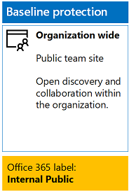
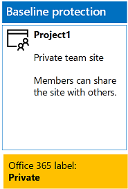
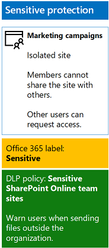
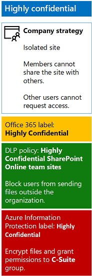
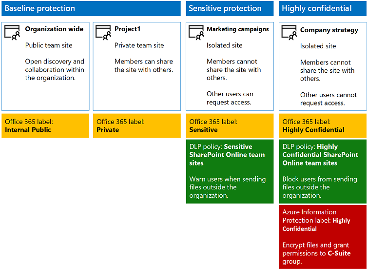

# <a name="secure-sharepoint-online-sites-in-a-devtest-environment"></a>在开发/测试环境中保护 SharePoint Online 网站

## <a name="introduction"></a>简介

本文提供了有关如何创建开发/测试环境的分步说明，该环境中包括用于[保护 SharePoint Online 网站和文件解决方案](secure-sharepoint-online-sites-and-files.md)的四种不同类型的 SharePoint Online 团队网站。

使用此开发/测试环境来试验信息保护行为，并根据具体要求微调设置，然后在生产中部署 SharePoint Online 团队网站。

## <a name="phase-1-create-your-devtest-environment"></a>阶段 1：创建开发/测试环境
在此阶段，将获取用于虚拟组织的 Office 365 和企业移动性 + 安全性的试用订阅。

首先，按照 [Office 365 开发/测试环境](https://technet.microsoft.com/library/mt736406.aspx)的阶段 2 中的说明进行操作。

接下来，注册 EMS 试用订阅并将其添加到与 Office 365 试用订阅相同的组织，然后执行以下步骤：

1. 如有需要，请使用试用订阅的全局管理员帐户的凭据登录 Office 365 门户。 如需帮助，请参阅[如何登录到 Office 365](https://support.office.com/Article/Where-to-sign-in-to-Office-365-e9eb7d51-5430-4929-91ab-6157c5a050b4)。
2. 单击“管理”磁贴。
3. 在浏览器的“Office 管理中心”选项卡的左侧导航中，单击“帐单”>“购买服务”。
4. 在“购买服务”页中，找到“企业移动性 + 安全性 E5”项，然后将鼠标指针悬停其上，并单击“开始免费试用”。
5. 在“确认订单”页中，单击“立即试用”。
6. 在“订单签收”页中，单击“继续”。

接下来，为全局管理员帐户启用企业移动性 + 安全性 E5 许可证。

1. 在浏览器的“Office 365 管理中心”选项卡的左侧导航中，单击“用户”>“活动用户”。
2. 单击全局管理员帐户，然后单击“针对产品许可证进行编辑”。
3. 在“产品许可证”窗格中，将“企业移动性 + 安全性 E5”的产品许可切换为“开”，单击“保存”，然后单击“关闭”两次。


## <a name="phase-2-create-and-configure-your-azure-active-directory-ad-groups-and-users"></a>阶段 2：创建和配置 Azure Active Directory (AD) 组和用户
此阶段为虚构组织创建和配置 Azure AD 组和用户。

首先，必须[与 Azure Active Directory V2 PowerShell 模块连接](https://go.microsoft.com/fwlink/?linkid=842218)。

接下来，从 PowerShell 命令提示符或集成脚本环境 (ISE) 中运行以下命令：
```
$groupNames=@("C-Suite","IT staff","Research staff","Regular staff","Marketing staff","Sales staff")
ForEach ($element in $groupNames){ New-AzureADGroup -DisplayName $element -MailEnabled $false -SecurityEnabled $true -MailNickName "NotSet" }
```

然后配置自动授权，以便组的成员可自动分配 Office 365 和 EMS 订阅的许可证，然后执行以下步骤：

1. 在浏览器中创建单独的标签页，然后转到 **Azure 门户** ([https://portal.azure.com](https://portal.azure.com))。如有需要，请使用 Office 365 E5 试用订阅的全局管理员帐户凭据登录。
2. 在 Azure 门户中，单击“Azure Active Directory”>“许可证”>“所有产品”。
3. 在列表中，选择“企业移动性 + 安全性 E5”和“Office 365 企业版 E5”，然后单击“分配”。
4. 在“分配许可证”边栏选项卡中，单击“用户和组”。
5. 在组列表中，选择以下各项：
 * 高层管理人员
 * IT 人员
 * 研究人员
 * 正式员工
 * 市场营销人员
 * 销售人员
6. 依次单击“选择”和“分配”。
7. 关闭浏览器中的 Azure 门户选项卡。

接下来，填写组织名称、位置和公用密码。 从 PowerShell 命令提示符或集成脚本环境 (ISE) 中运行以下命令，创建用户帐户。 然后，将其添加到对应的组。

```
$orgName="[organization name, such as contoso for the contoso.onmicrosoft.com trial subscription domain name]"
$location="[the ISO ALPHA2 country code, such as US for the United States]"
$commonPassword="[common password for all the new accounts]"

$PasswordProfile=New-Object -TypeName Microsoft.Open.AzureAD.Model.PasswordProfile
$PasswordProfile.Password=$commonPassword

$groupName="C-Suite"
$userNames=@("CEO","CFO","CIO")
$groupID=(Get-AzureADGroup | Where { $_.DisplayName -eq $groupName }).ObjectID
ForEach ($element in $userNames){
New-AzureADUser -DisplayName $element -PasswordProfile $PasswordProfile -UserPrincipalName ($element + "@" + $orgName + ".onmicrosoft.com") -AccountEnabled $true -MailNickName $element -UsageLocation $location
Add-AzureADGroupMember -RefObjectId (Get-AzureADUser | Where { $_.DisplayName -eq $element }).ObjectID -ObjectId $groupID
}
$groupName="IT staff"
$userNames=@("ITAdmin1","ITAdmin2")
$groupID=(Get-AzureADGroup | Where { $_.DisplayName -eq $groupName }).ObjectID
ForEach ($element in $userNames){
New-AzureADUser -DisplayName $element -PasswordProfile $PasswordProfile -UserPrincipalName ($element + "@" + $orgName + ".onmicrosoft.com") -AccountEnabled $true -MailNickName $element -UsageLocation $location
Add-AzureADGroupMember -RefObjectId (Get-AzureADUser | Where { $_.DisplayName -eq $element }).ObjectID -ObjectId $groupID
}
$groupName="Research staff"
$userNames=@("Researcher1")
$groupID=(Get-AzureADGroup | Where { $_.DisplayName -eq $groupName }).ObjectID
ForEach ($element in $userNames){
New-AzureADUser -DisplayName $element -PasswordProfile $PasswordProfile -UserPrincipalName ($element + "@" + $orgName + ".onmicrosoft.com") -AccountEnabled $true -MailNickName $element -UsageLocation $location
Add-AzureADGroupMember -RefObjectId (Get-AzureADUser | Where { $_.DisplayName -eq $element }).ObjectID -ObjectId $groupID
}
$groupName="Regular staff"
$userNames=@("Regular1", "Regular2")
$groupID=(Get-AzureADGroup | Where { $_.DisplayName -eq $groupName }).ObjectID
ForEach ($element in $userNames){
New-AzureADUser -DisplayName $element -PasswordProfile $PasswordProfile -UserPrincipalName ($element + "@" + $orgName + ".onmicrosoft.com") -AccountEnabled $true -MailNickName $element -UsageLocation $location
Add-AzureADGroupMember -RefObjectId (Get-AzureADUser | Where { $_.DisplayName -eq $element }).ObjectID -ObjectId $groupID
}
$groupName="Marketing staff"
$userNames=@("Marketing1", "Marketing2")
$groupID=(Get-AzureADGroup | Where { $_.DisplayName -eq $groupName }).ObjectID
ForEach ($element in $userNames){
New-AzureADUser -DisplayName $element -PasswordProfile $PasswordProfile -UserPrincipalName ($element + "@" + $orgName + ".onmicrosoft.com") -AccountEnabled $true -MailNickName $element -UsageLocation $location
Add-AzureADGroupMember -RefObjectId (Get-AzureADUser | Where { $_.DisplayName -eq $element }).ObjectID -ObjectId $groupID
}
$groupName="Sales staff"
$userNames=@("SalesPerson1")
$groupID=(Get-AzureADGroup | Where { $_.DisplayName -eq $groupName }).ObjectID
ForEach ($element in $userNames){
New-AzureADUser -DisplayName $element -PasswordProfile $PasswordProfile -UserPrincipalName ($element + "@" + $orgName + ".onmicrosoft.com") -AccountEnabled $true -MailNickName $element -UsageLocation $location
Add-AzureADGroupMember -RefObjectId (Get-AzureADUser | Where { $_.DisplayName -eq $element }).ObjectID -ObjectId $groupID
}
```

>[!Note]
>此处使用公用密码旨在自动配置开发/测试环境，简化配置过程。 但不建议生产订阅这样做。
>

接下来，请按照以下步骤验证基于组的许可是否正常工作。

1. 在浏览器的“Microsoft Office 主页”标签页中，单击“管理”磁贴。
2. 在浏览器的新“Office 管理中心”标签页中，单击“用户”。
3. 在用户列表中，单击“CEO”。
4. 在列出 CEO 用户帐户属性的窗格中，验证已向其分配“企业移动性 + 安全性 E5”和“Office 365 企业版 E5”许可证（位于“产品许可证”中）。 

## <a name="phase-3-create-office-365-labels"></a>阶段 3：创建 Office 365 标签

此阶段将针对 SharePoint Online 团队网站文档文件夹的不同安全级别创建标签。

1. 如有必要，使用 Internet 浏览器的私有实例并使用 Office 365 E5 试用订阅的全局管理员帐户登录 Office 365 门户。 如需帮助，请参阅[如何登录到 Office 365](https://support.office.com/Article/Where-to-sign-in-to-Office-365-e9eb7d51-5430-4929-91ab-6157c5a050b4)。
2. 在“Microsoft Office 主页”标签页中，单击“管理”磁贴。
3. 在浏览器的新“Office 管理中心”标签页中，单击“管理中心”>“安全性和符合性”。
4. 在浏览器的新“主页 -安全性和符合性”标签页中，单击“分类”>“标签”。
5. 在“开始”>“标签”窗格中，单击“创建标签”。
 1. 在“命名标签”窗格中，键入“内部公用”，然后单击“下一步”。
 2. 在“标签设置”窗格中，单击“下一步”。
 3. 在“查看设置”窗格中，单击“创建此标签”，然后单击“关闭”。
6. 对下面的其他标签重复上述步骤：
 * Private
 * 敏感
 * 高度机密
7. 在“开始”>“标签”窗格中，单击“发布标签”。
8. 在“选择要发布的标签”窗格中，单击“选择要发布的标签”。
9. 在“选择标签”窗格中，单击“添加”并选择全部四个标签，然后单击“完成”。
10. 在“选择要发布的标签”窗格中，单击“下一步”。
11. 在“选择位置”窗格中，单击“下一步”。
12. 在“为策略命名”窗格中，在“名称”中键入“示例组织”，然后单击“下一步”。
13. 在“查看设置”窗格中，单击“发布标签”，然后单击“关闭”。

## <a name="phase-4-create-your-sharepoint-online-team-sites"></a>阶段 4：创建 SharePoint Online 团队网站
在此阶段中，将为示例组织创建和配置四种类型的 SharePoint Online 团队网站。

### <a name="organization-wide-team-site"></a>组织范围团队网站
要创建基线公共 SharePoint Online 团队网站，请执行以下操作：

1. 如果需要，请使用本地计算机上的浏览器，并使用全局管理员帐户登录 Office 365 门户。 如需帮助，请参阅[如何登录到 Office 365](https://support.office.com/Article/Where-to-sign-in-to-Office-365-e9eb7d51-5430-4929-91ab-6157c5a050b4)。
2. 在磁贴列表中，单击“SharePoint”。
3. 在浏览器的新“SharePoint”标签页中，单击“+ 创建网站”。
4. 在“创建网站”页中，单击“团队网站”。
5. 在“网站名称”中，键入“组织范围”。
6. 在“团队网站描述”中，键入“用于整个组织的 SharePoint 网站”。
7. 在“隐私设置”中，选择“公用 - 组织中的任何人都可以访问此网站”，然后单击“下一步”。
8. 在“希望添加哪些人员?”窗格中，单击“完成”。

接下来，针对内部公共标签配置组织范围团队网站的文档文件夹。

1. 在浏览器的“组织范围 - 主页”标签页中，单击“文档”。
2. 单击设置图标，然后单击“库设置”。
3. 在“权限和管理”下，单击“向此库中的项应用标签”。
4. 在“设置-应用标签”中，选择“内部公用”，然后单击“保存”。

生成的配置如下。

 

### <a name="project-1-team-site"></a>项目 1 团队网站
要为组织内的项目创建基线专用 SharePoint Online 团队网站，请执行以下操作：

1. 如果需要，请使用本地计算机上的浏览器，并使用全局管理员帐户登录 Office 365 门户。 如需帮助，请参阅[如何登录到 Office 365](https://support.office.com/Article/Where-to-sign-in-to-Office-365-e9eb7d51-5430-4929-91ab-6157c5a050b4)。
2. 在磁贴列表中，单击“SharePoint”。
3. 在浏览器的新“SharePoint”标签页中，单击“+ 创建网站”。
4. 在“创建网站”页中，单击“团队网站”。
5. 在“网站名称”中，键入“项目 1”。
6. 在“团队网站描述”中，键入“用于项目 1 的 SharePoint 网站”。
7. 在“隐私设置”中，选择“专用 - 只有成员可以访问此网站”，然后单击“下一步”。
8. 在“希望添加哪些人员?”窗格中，单击“完成”。

接下来，针对专用标签配置项目 1 团队网站的文档文件夹。

1. 在浏览器的“项目 1 - 主页”标签页中，单击“文档”。
2. 单击设置图标，然后单击“库设置”。
3. 在“权限和管理”下，单击“向此库中的项应用标签”。
4. 在“设置-应用标签”中，选择“专用”，然后单击“保存”。

生成的配置如下。

 

### <a name="marketing-campaigns-team-site"></a>市场营销活动团队网站

要为市场营销活动资源创建敏感级别的独立 SharePoint Online 团队网站，请执行以下操作：

1. 请使用本地计算机上的浏览器，并使用全局管理员帐户登录 Office 365 门户。 如需帮助，请参阅[如何登录到 Office 365](https://support.office.com/Article/Where-to-sign-in-to-Office-365-e9eb7d51-5430-4929-91ab-6157c5a050b4)。
2. 在磁贴列表中，单击“SharePoint”。
 1. 在浏览器的新“SharePoint”标签页中，单击“+ 创建网站”。
 2. 在“创建网站”页中，单击“团队网站”。
3. 在“团队网站名称”中，键入“市场营销活动”。
4. 在“团队网站描述”中，键入“用于市场营销活动资源的 SharePoint 网站(敏感)”。
5. 在“隐私设置”中，选择“专用 - 只有成员可以访问此网站”，然后单击“下一步”。
6. 在“希望添加哪些人员?”窗格中，单击“完成”。
7. 在浏览器的新“市场营销活动”标签页中，在工具栏中单击设置图标，然后单击“网站权限”。
8. 在“网站权限”窗格中，单击“高级权限设置”。
9. 在浏览器的新“权限”标签页中，单击“访问请求设置”。
10. 在“访问请求设置”对话框中：
  1. 清除“允许成员共享网站和单独的文件和文件夹”和“允许成员邀请他人到网站成员组”复选框。
  2. 在“发送所有访问请求”中，键入“ITAdmin1@[组织名称].onmicrosoft.com”。
  3. 单击" **确定**"。
11. 单击列表中的“市场营销活动成员”。
12. 在“人员和组”页中，单击“新建”。
13. 在“共享”对话框中，键入“市场营销人员”，将其选中，然后单击“共享”。
14. 对 Researcher1 用户帐户重复上述步骤。
15. 单击浏览器中的后退按钮，然后单击列表中的“市场营销活动所有者”。
16. 在“人员和组”页中，单击“新建”。
17. 在“共享”对话框中，键入“IT 人员”，将其选中，然后单击“共享”。
18. 单击浏览器中的后退按钮，关闭浏览器中的“人员和组”标签页，单击浏览器中的“市场营销活动 - 主页”标签页，然后关闭“网站权限”窗格。

权限的配置结果如下所示：

* 市场营销活动-成员：SharePoint 组仅包含“市场营销活动”组（其中包含全局管理员用户帐户）、“市场营销人员”组（其中包含 Marketing1 和 Marketing2 用户帐户）以及 Researcher1 用户帐户。
* 市场营销活动-所有者：SharePoint 组仅包含“IT 人员”组（其中仅包含 ITAdmin1 和 ITAdmin2 用户帐户）。
* 市场营销活动-访问者：SharePoint 组不包含任何组或用户帐户。
* 成员不能修改网站级权限（此设置只能由营销活动-所有者组的成员执行）。
* 其他用户帐户无法访问网站或其资源，但可以请求访问网站，将向 ITAdmin1 用户帐户邮箱发送电子邮件。

接下来，针对敏感标签配置市场营销活动团队网站的文档文件夹。

1. 在浏览器的“市场营销活动 - 主页”标签页中，单击“文档”。
2. 单击设置图标，然后单击“库设置”。
3. 在“权限和管理”下，单击“向此库中的项应用标签”。
4. 在“设置-应用标签”中，选择“敏感”，然后单击“保存”。

接下来，配置数据丢失防护 (DLP) 策略，以便在用户共享关于含敏感标签的 SharePoint Online 团队网站（包括组织外的营销活动网站）的文档时进行通知。

1. 在浏览器的“Microsoft Office 主页”标签页中，单击“安全性与符合性”磁贴。
2. 在浏览器的新“安全性与符合性”标签页中，单击“数据丢失防护”>“策略”。
3. 在“数据丢失防护”窗格中，单击“+ 创建策略”。
4. 在“从模板开始或创建自定义策略”窗格中，单击“自定义”，然后单击“下一步”。
5. 在“为策略命名”窗格中，在“名称”中键入“敏感标签 SharePoint Online 团队网站”，然后单击“下一步”。
6. 在“选择位置”窗格中，单击“允许选择特定位置”，然后单击“下一步”。
7. 在位置列表中，禁用“Exchange 电子邮件”和“OneDrive 帐户位置”，然后单击“下一步”。
8. 在“自定义要保护的敏感信息类型”窗格中，单击“编辑”。
9. 在“选择要保护的内容类型”窗格中，单击下拉框中的“添加”，然后单击“标签”。 
10. 在“标签”窗格中，单击“+ 添加”，选择“敏感”标签，然后依次单击“添加”和“完成”。
11. 在“选择要保护的内容类型”窗格中，单击“保存”。
12. 在“自定义要保护的敏感信息类型”窗格中，单击“下一步”。
13. 在“如果检测到敏感信息，希望采取什么操作?”窗格中，单击“自定义提示和电子邮件”。
14. 在“自定义策略提示和电子邮件通知”窗格中，单击“自定义策略提示文本”。
15. 在文本框中，键入或粘贴以下内容，然后单击“确定”：
 * 要与组织外部的用户共享，请下载并打开文件。 依次单击“文件”、“保护文档”、“使用密码加密”，然后指定强密码。 通过单独的电子邮件或其他通信方式发送密码。
16. 在“如果检测到敏感信息，希望采取什么操作?”窗格中，清除“阻止共享并将访问限于共享内容”复选框，然后单击“下一步”。
17. 在“是否希望立即启用策略或先进行测试?”窗格中，单击“是，立即启用”，然后单击“下一步”。
18. 在“查看设置”窗格中，单击“创建”，然后单击“关闭”。

生成的配置如下。

 

### <a name="company-strategy-team-site"></a>公司策略团队网站
若要针对组织首席执行官的公司战略资源创建高度机密级别的独立 SharePoint Online 团队网站，请执行以下操作：

1. 如果需要，请使用本地计算机上的浏览器，并使用全局管理员帐户登录 Office 365 门户。 如需帮助，请参阅[如何登录到 Office 365](https://support.office.com/Article/Where-to-sign-in-to-Office-365-e9eb7d51-5430-4929-91ab-6157c5a050b4)。
2. 在磁贴列表中，单击“SharePoint”。
3. 在浏览器的新“SharePoint”标签页中，单击“+ 创建网站”。
  1. 在“创建网站”页中，单击“团队网站”。
  2. 在“团队网站名称”中，键入“公司战略”。
  3. 在“团队网站描述”中，键入“针对公司战略的 SharePoint 网站(高度机密)”。
4. 在“隐私设置”中，选择“专用 - 只有成员可以访问此网站”，然后单击“下一步”。
5. 在“希望添加哪些人员?”窗格中，单击“完成”。
6. 在浏览器的新“公司战略”标签页中，在工具栏中单击设置图标，然后单击“网站权限”。
7. 在“网站权限”窗格中，单击“高级权限设置”。
8. 在浏览器的新“权限”标签页中，单击“访问请求设置”。
9. 在“访问请求设置”对话框中，清除“允许成员共享网站和单独的文件和文件夹”和“允许成员邀请他人到网站成员组”（这样三个复选框全都被清除），然后单击“确定”。
10. 单击列表中的“公司战略成员”，然后在“人员和组”页中单击“新建”。
11. 在“共享”对话框中，键入“高层管理人员”，将其选中，然后单击“共享”。
12. 单击列表中的“公司战略所有者”，然后在“人员和组”页中单击“新建”。
13. 在“共享”对话框中，键入“IT 人员”，将其选中，然后单击“共享”。
14. 单击浏览器中的后退按钮，然后关闭“人员和组”标签页。
15. 单击浏览器中的“公司战略-主页”标签页，然后关闭“网站权限”窗格。

权限的配置结果如下所示：

* 公司战略-成员：SharePoint 组仅包含“高层管理人员”组（其中仅包含 CEO、CFO和 CIO 用户帐户）和“公司战略”组（其中仅包含全局管理员用户帐户）。
* 公司战略-所有者：SharePoint 组仅包含“IT 人员”组（其中仅包含 ITAdmin1 和 ITAdmin2 用户帐户）。
* 公司战略-访问者：SharePoint 组不包含任何组或用户帐户。
* 成员不能修改网站级别权限（仅“公司战略-所有者”组的成员才可进行修改）。
* 其他用户帐户无法访问网站或其资源，也无法请求访问网站。 网站的其他权限必须由全局管理员或“公司战略-所有者”组的成员履行。

接下来，针对高度机密标签配置公司战略团队网站的文档文件夹。

1. 在浏览器的“公司战略-主页”标签页中，单击“文档”。
2. 单击设置图标，然后单击“库设置”。
3. 在“权限和管理”下，单击“向此库中的项应用标签”。
4. 在“设置-应用标签”中，选择“高度机密”，然后单击“保存”。

接下来，配置 DLP 策略，当用户在具有“高度机密”标签的 SharePoint Online 团队网站（包括组织外的公司战略网站）上共享文档时，该策略会阻止用户。

1. 如果需要，请使用本地计算机上的浏览器，并使用具有安全管理员或公司管理员角色的帐户登录 Office 365 门户。 如需帮助，请参阅[如何登录到 Office 365](https://support.office.com/Article/Where-to-sign-in-to-Office-365-e9eb7d51-5430-4929-91ab-6157c5a050b4)。
2. 在浏览器的“Microsoft Office 主页”标签页中，单击“安全性与符合性”磁贴。
3. 在浏览器的新“安全性与符合性”标签页中，单击“数据丢失防护”>“策略”。
4. 在“数据丢失防护”窗格中，单击“+ 创建策略”。
5. 在“从模板开始或创建自定义策略”窗格中，单击“自定义”，然后单击“下一步”。
6. 在“为策略命名”窗格中，在“名称”中键入“高度机密标签 SharePoint Online 团队网站”，然后单击“下一步”。
7. 在“选择位置”窗格中，单击“允许选择特定位置”，然后单击“下一步”。
8. 在位置列表中，禁用“Exchange 电子邮件”和“OneDrive 帐户位置”，然后单击“下一步”。
9. 在“自定义要保护的敏感信息类型”窗格中，单击“编辑”。
10. 在“选择要保护的内容类型”窗格中，单击下拉框中的“添加”，然后单击“标签”。
11. 在“标签”窗格中，单击“+ 添加”，选择“高度机密标签”，依次单击“添加”和“完成”。
12. 在“选择要保护的内容类型”窗格中，单击“保存”。
13. 在“自定义要保护的敏感信息类型”窗格中，单击“下一步”。
14. 在“如果检测到敏感信息，希望采取什么操作?”窗格中，单击“自定义提示和电子邮件”。
15. 在“自定义策略提示和电子邮件通知”窗格中，单击“自定义策略提示文本”。
16. 在文本框中，键入或粘贴以下内容，然后单击“确定”：
 * 要与组织外部的用户共享，请下载并打开文件。 依次单击“文件”、“保护文档”、“使用密码加密”，然后指定强密码。 通过单独的电子邮件或其他通信方式发送密码。
17. 在“如果检测到敏感信息，希望采取什么操作?”窗格中，选择“需要业务理由进行重写”，然后单击“下一步”。
18. 在“是否希望立即启用策略或先进行测试?”窗格中，单击“是，立即启用”，然后单击“下一步”。
19. 在“查看设置”窗格中，单击“创建”，然后单击“关闭”。

接下来，按照[使用 Office 365 管理中心激活 Azure RMS](https://docs.microsoft.com/information-protection/deploy-use/activate-office365) 中的说明进行操作。

接下来，使用保护和权限配置 Azure 信息保护高度机密标签，并执行以下步骤：

1. 在已使用全局管理员帐户登录的浏览器的单独标签页中，转到 **Azure 门户** ([http://portal.azure.com](http://portal.azure.com/))。
2. 在列表窗格中，单击“更多服务”，键入“信息”，然后单击“Azure 信息保护”。
3. 在“Azure 信息保护 - 全局策略”边栏选项卡，在标签列表下，单击“高度机密”。
4. 在“标签: 机密”边栏选项卡，在“为包含此标签的文档和电子邮件设置权限”中，单击“保护”。
5. 在“保护”部分中，单击“Azure RMS”。
6. 在“保护”边栏选项卡中，在“保护设置”下，单击“+ 添加权限”。
7. 在“添加权限”边栏选项卡中，在“选择用户和组”下，单击“+ 选择用户和组”。
8. 在“AAD 用户和组”窗格中，选择“高层管理人员”，然后单击“选择”。
9. 在“从预设中选择权限”下，清除“打印、复制和提取内容”和“转接”复选框。
10. 单击 **“确定”** 两次。
11. 在“标签: 高度机密”边栏选项卡中，单击“保存”。
12. 在“Azure 信息保护 - 全局策略”边栏选项卡中，单击“发布”。

若要使用 Azure 信息保护和高度机密标签保护文档，必须在测试计算机上[安装 Azure 信息保护客户端](https://docs.microsoft.com/information-protection/rms-client/install-client-app)，从 Office 365 门户安装 Office，然后使用试用订阅的“高层管理人员”组中的帐户从 Microsoft Word 登录。

生成的配置如下。

 

### <a name="create-documents-and-test-access"></a>创建文档并测试访问

现在，可以在这四个网站中创建文档，并使用试用订阅中的各种用户帐户进行访问测试。

下面是针对全部四个 SharePoint Online 团队网站的整体配置。

 

如果已准备好进行安全 SharePoint Online 网站的生产部署，请参阅[保护 SharePoint Online 网站和文件](https://technet.microsoft.com/library/mt842190.aspx)，了解详细信息，获取分步部署文章的链接。


## <a name="next-steps"></a>后续步骤
[保护 SharePoint Online 网站和文件](secure-sharepoint-online-sites-and-files.md)

[安全解决方案](https://technet.microsoft.com/library/mt784690.aspx)

[云应用和混合解决方案](https://technet.microsoft.com/library/dn262744.aspx)

[Microsoft 针对政治宣传活动、非营利组织和其他敏捷型组织的安全指南](https://technet.microsoft.com/library/mt493213.aspx)
